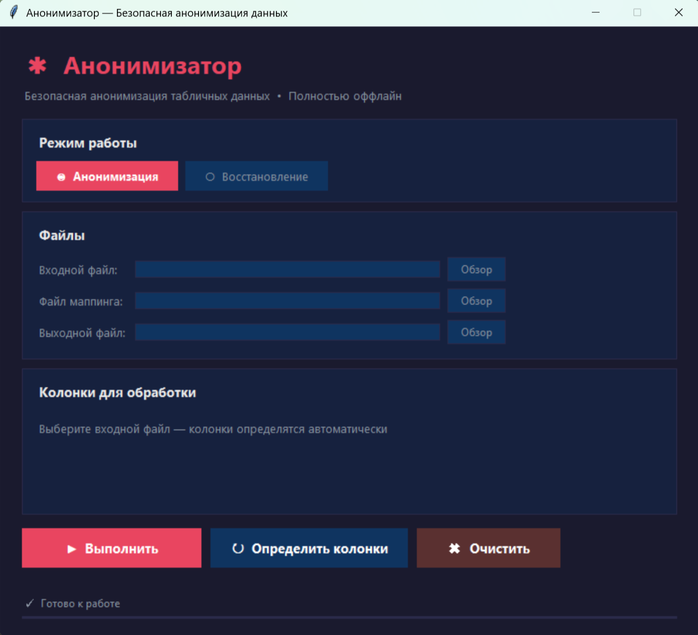

# Анонимизатор — безопасная работа с персональными данными в таблицах

Локальное приложение, которое заменяет персональные данные в таблице (ФИО, телефоны, email, паспорта, ИНН, адреса, даты рождения) на обезличенные метки вида `NAME_001`, и умеет вернуть исходные значения обратно — точно и полностью.

Приложение работает **полностью офлайн**: ни одна строка данных никуда не отправляется. Нейросети не используются — только детерминированные алгоритмы.

---

## 1. Что делает сервис и для кого он создан

Персональные данные постоянно приходится кому-то передавать: подрядчику на анализ, разработчику для отладки, в отдел аналитики, тестировщику. Передавать таблицу с настоящими ФИО и телефонами нельзя, а готовить «чистую» версию вручную долго и ненадёжно — что-то обязательно останется.

Анонимизатор делает это за одну операцию и — главное — **обратимо**: результат анализа, вернувшийся от подрядчика, можно сопоставить обратно с живыми людьми по файлу соответствий, который остаётся только у вас.

Для кого:

- **аналитик и исследователь данных** — отдаёт таблицу на сторону, не раскрывая людей;
- **разработчик и тестировщик** — работает с реалистичными данными без доступа к настоящим;
- **владелец бизнеса и ответственный за персональные данные** — снижает риск утечки при передаче файлов;
- **бухгалтерия и кадры** — готовят выгрузки для внешних исполнителей.

### Возможности

- **Автоопределение персональных колонок** по названию: ФИО, имя, фамилия, телефон, email, паспорт, ИНН, адрес, дата рождения — в русском и английском написании.
- **Обезличивание с сохранением связей** — одно и то же значение всегда получает одну и ту же метку, поэтому связи между строками не рушатся и данные остаются пригодными для анализа.
- **Полная обратимость** — исходная таблица восстанавливается из обезличенной и файла соответствий без потерь.
- **Шифрование файла соответствий паролем** (алгоритм Fernet) — самый чувствительный файл можно хранить в зашифрованном виде.
- **Два интерфейса** — оконное приложение для повседневной работы и команда в терминале для автоматизации.
- **Форматы** — Excel (`.xlsx`, `.xls`) и CSV.
- **Сведения о файле соответствий** — отдельная команда показывает, какие колонки и сколько значений в нём содержатся.
- **21 автотест** проверяет обезличивание, определение колонок, хранение соответствий и шифрование.

---

## 2. Интерфейс

Главное окно: выбор режима (обезличивание или восстановление), файлы и список колонок, определённых автоматически.



Что происходит с данными — на примере демонстрационного файла `sample_data.xlsx` с тестовыми данными:

| ID | Name | Phone | Email | Age |
|---|---|---|---|---|
| 1 | Ivanov Ivan | +79001112233 | ivanov@mail.ru | 35 |
| 2 | Petrova Maria | +79004445566 | petrova@gmail.com | 28 |

После обезличивания:

| ID | Name | Phone | Email | Age |
|---|---|---|---|---|
| 1 | NAME_001 | PHONE_001 | EMAIL_001 | 35 |
| 2 | NAME_002 | PHONE_002 | EMAIL_002 | 28 |

Колонки `ID` и `Age` не персональные — они остались нетронутыми, и таблица по-прежнему пригодна для анализа.

---

## 3. Системные требования

| Что нужно | Версия | Зачем |
|---|---|---|
| Python | 3.10 и новее | Среда выполнения |
| Git | любая актуальная | Склонировать репозиторий |
| Операционная система | Windows 10/11, macOS 12+, Linux | Оконный интерфейс использует встроенный в Python модуль Tkinter |
| Свободное место | около 300 МБ | Виртуальное окружение с зависимостями |

Интернет нужен **только один раз** — на этапе установки зависимостей. Дальше приложение работает без сети.

Проверено на Python 3.14.7 со следующими версиями библиотек: pandas 3.0.5, openpyxl 3.1.5, cryptography 50.0.0, rich 15.0.0, customtkinter 6.0.0.

На Linux модуль Tkinter иногда не входит в поставку Python. Если оконный интерфейс не запускается, установите его:

```bash
sudo apt update && sudo apt install -y python3-tk
```

---

## 4. Установка с чистого компьютера

### 4.1. Установите Python

- **Windows:** скачайте установщик с https://www.python.org/downloads/ и на первом экране **обязательно** отметьте галочку «Add Python to PATH».
- **macOS:** скачайте установщик с того же сайта или выполните `brew install python`.
- **Linux (Ubuntu/Debian):**

  ```bash
  sudo apt update && sudo apt install -y python3 python3-venv python3-tk
  ```

Проверьте установку:

```bash
python --version
```

Если команда не найдена, попробуйте:

```bash
python3 --version
```

Версия должна быть 3.10 или выше.

### 4.2. Установите Git

- **Windows:** установщик https://git-scm.com/download/win с настройками по умолчанию.
- **macOS:**

  ```bash
  xcode-select --install
  ```

- **Linux (Ubuntu/Debian):**

  ```bash
  sudo apt update && sudo apt install -y git
  ```

### 4.3. Склонируйте репозиторий

```bash
git clone https://github.com/Yaroslava-111/anonymizer.git
cd anonymizer
```

### 4.4. Создайте виртуальное окружение

Виртуальное окружение — отдельная папка с библиотеками только для этого проекта. Оно нужно, чтобы зависимости не конфликтовали с другими программами на компьютере.

**Windows (PowerShell):**

```powershell
python -m venv .venv
.venv\Scripts\Activate.ps1
```

Если PowerShell откажется выполнять сценарий, разрешите запуск один раз для текущего окна:

```powershell
Set-ExecutionPolicy -Scope Process -ExecutionPolicy Bypass
```

**macOS и Linux:**

```bash
python3 -m venv .venv
source .venv/bin/activate
```

Признак успеха: в начале строки терминала появилась пометка `(.venv)`.

Чтобы выйти из окружения, выполните `deactivate`. Перед каждым новым запуском приложения окружение нужно активировать заново той же командой.

### 4.5. Установите зависимости

```bash
pip install -r requirements.txt
```

Установка занимает одну–две минуты.

---

## 5. Запуск

Перед запуском убедитесь, что виртуальное окружение активировано (в строке терминала видна пометка `(.venv)`).

### Способ 1. Оконное приложение

```bash
python app_gui.py
```

На Windows можно просто дважды щёлкнуть по файлу `Запуск.bat` в папке проекта.

Порядок работы в окне:

1. Выберите режим — **«Анонимизация»** или **«Восстановление»**.
2. Укажите входной файл кнопкой **«Обзор»**.
3. Нажмите **«Определить колонки»** — приложение само найдёт персональные колонки и покажет их список.
4. Нажмите **«Выполнить»**.

### Способ 2. Команда в терминале

Обезличить таблицу:

```bash
python main.py anonymize -i sample_data.xlsx -o anon.xlsx -m map.json -c "Name,Phone,Email"
```

Если не указать `-c`, программа покажет найденные колонки и спросит, какие из них обрабатывать.

Восстановить исходные данные:

```bash
python main.py deanonymize -i anon.xlsx -m map.json -o restored.xlsx
```

Посмотреть, что лежит в файле соответствий:

```bash
python main.py info -m map.json
```

Зашифровать файл соответствий паролем:

```bash
python main.py encrypt-mapping -m map.json -p ВАШ_ПАРОЛЬ -o map.json.enc
```

Расшифровать обратно:

```bash
python main.py decrypt-mapping -m map.json.enc -p ВАШ_ПАРОЛЬ -o map.json
```

---

## 6. Проверка работоспособности

### 6.1. Автотесты

```bash
python -m pytest tests -q
```

**Ожидаемый результат:** `21 passed`. Тесты покрывают обезличивание, определение персональных колонок, хранение файла соответствий и шифрование.

Если `pytest` не найден, установите его в активированном окружении:

```bash
pip install pytest
```

### 6.2. Главный пользовательский сценарий

Проверка занимает две минуты и выполняется на демонстрационном файле `sample_data.xlsx`, который лежит в репозитории.

1. Обезличьте демонстрационную таблицу:

   ```bash
   python main.py anonymize -i sample_data.xlsx -o anon.xlsx -m map.json -c "Name,Phone,Email"
   ```

   **Ожидаемый результат:** в терминале сообщение вида «Name: 5 уникальных значений → индексы 1-5», рядом появились файлы `anon.xlsx` и `map.json`.

2. Откройте `anon.xlsx` в Excel или другом табличном редакторе.
   **Ожидаемый результат:** вместо имён, телефонов и адресов почты — метки `NAME_001`, `PHONE_001`, `EMAIL_001`; колонки `ID` и `Age` не изменились.

3. Восстановите исходные данные:

   ```bash
   python main.py deanonymize -i anon.xlsx -m map.json -o restored.xlsx
   ```

4. Откройте `restored.xlsx`.
   **Ожидаемый результат:** таблица полностью совпадает с `sample_data.xlsx` — это и есть проверка обратимости, главного свойства приложения.

5. Посмотрите содержимое файла соответствий:

   ```bash
   python main.py info -m map.json
   ```

   **Ожидаемый результат:** таблица с перечнем колонок и количеством значений в каждой.

Если все пять шагов прошли как описано, приложение исправно.

---

## 7. Переменные окружения

Переменных окружения в проекте **нет**, файла `.env.example` тоже нет. Приложение не обращается к внешним сервисам, API-ключи и токены ему не нужны.

Единственный секрет в работе — **пароль для шифрования файла соответствий**. Он нигде не сохраняется: вы вводите его при шифровании и при расшифровке. **Если пароль потерян, восстановить файл соответствий невозможно** — и вместе с ним теряется связь обезличенных данных с реальными людьми.

Настройки распознавания колонок задаются в файле `config.py`: словарь `PERSONAL_COLUMN_PATTERNS` сопоставляет название колонки с типом персональных данных. Чтобы приложение понимало ваши заголовки, допишите их туда.

---

## 8. Структура проекта

```text
anonymizer/
├── main.py                       # Командный интерфейс: anonymize, deanonymize, info, шифрование
├── app_gui.py                    # Оконное приложение
├── anonymizer.py                 # Ядро: замена значений на метки
├── deanonymizer.py               # Ядро: обратная замена
├── column_detector.py            # Автоопределение персональных колонок
├── mapping_store.py              # Чтение и запись файла соответствий
├── crypto_utils.py               # Шифрование файла соответствий паролем (Fernet)
├── config.py                     # Словарь названий колонок и типов данных
├── tests/                        # 21 автотест
├── sample_data.xlsx              # Демонстрационная таблица для проверки
├── docs/screenshots/             # Скриншоты для этого файла
├── requirements.txt              # Зависимости
├── Запуск.bat                    # Запуск оконного приложения в Windows
├── TECHNICAL_SPECIFICATION.md    # Техническое задание: требования и архитектура
└── README.md
```

---

## 9. Публикация

Приложение **не предназначено для размещения в интернете** — это принципиальное требование, а не упущение. Весь смысл в том, что персональные данные не покидают компьютер.

Поэтому «публикация» здесь означает установку на рабочие места сотрудников. Два рабочих варианта:

1. **Повторить установку на каждом компьютере** по разделу 4 — надёжнее всего.
2. **Собрать исполняемый файл** для Windows, чтобы не устанавливать Python на каждую машину:

   ```bash
   pip install pyinstaller
   pyinstaller --onefile --windowed --name Анонимизатор app_gui.py
   ```

   Готовый файл появится в папке `dist/`. Этот вариант в проекте не тестировался — проверьте работу перед раздачей сотрудникам.

Размещать приложение на GitHub Pages, веб-хостинге или в облачном сервисе нельзя: это противоречит его назначению.

---

## 10. Обновление

В папке проекта:

```bash
git pull
```

Затем обновите зависимости в активированном виртуальном окружении:

```bash
pip install -r requirements.txt --upgrade
```

После обновления обязательно прогоните автотесты:

```bash
python -m pytest tests -q
```

Ваши рабочие файлы при обновлении не затрагиваются: таблицы и файлы соответствий лежат там, где вы их сохранили, а не внутри проекта.

Если вы правили `config.py` под свои названия колонок, при обновлении возможен конфликт слияния. Безопасный порядок:

```bash
git stash
git pull
git stash pop
```

---

## 11. Резервное копирование и восстановление

Своей базы данных у приложения нет — всё хранится в обычных файлах. Критичны два из них:

| Файл | Что это | Насколько критичен |
|---|---|---|
| Файл соответствий (`map.json` или `*.enc`) | Связь меток с настоящими значениями | **Критично.** Потеряли — восстановить исходные данные невозможно |
| Исходная таблица | Данные до обезличивания | Важно, если другой копии нет |

### Правила хранения

1. **Храните файл соответствий отдельно от обезличенной таблицы.** Вместе они равны исходным данным — смысл обезличивания пропадает.
2. **Зашифруйте файл соответствий**, если он хранится где-то, кроме вашего компьютера:

   ```bash
   python main.py encrypt-mapping -m map.json -p ВАШ_ПАРОЛЬ -o map.json.enc
   ```

3. **Пароль храните в менеджере паролей.** Забытый пароль означает безвозвратную потерю связи с исходными данными.

### Сделать резервную копию

```bash
cp map.json map-backup-$(date +%Y-%m-%d).json
```

В Windows PowerShell:

```powershell
Copy-Item map.json "map-backup-$(Get-Date -Format yyyy-MM-dd).json"
```

### Восстановить

Расшифруйте копию, если она зашифрована, и используйте как обычный файл соответствий:

```bash
python main.py decrypt-mapping -m map-backup-2026-10-05.json.enc -p ВАШ_ПАРОЛЬ -o map.json
python main.py deanonymize -i anon.xlsx -m map.json -o restored.xlsx
```

---

## 12. Известные ограничения

- **Персональные данные распознаются по названию колонки, а не по содержимому.** Колонка с нестандартным заголовком («Контакт», «Кому звонить») не будет найдена автоматически — укажите её вручную или дополните `config.py`.
- **Персональные данные внутри текста не обрабатываются.** Если телефон упомянут в колонке «Комментарий», он останется в таблице как есть.
- **Нет защиты от восстановления по косвенным признакам.** Если в таблице остались редкие сочетания (должность, город, дата рождения), человека всё ещё можно вычислить. Анонимизатор убирает прямые идентификаторы, а не гарантирует полную неидентифицируемость.
- **Один файл за раз.** Пакетная обработка папки не поддерживается.
- **Файлы соответствий не объединяются.** Два файла, обезличенные по отдельности, получат независимую нумерацию, и одно значение может иметь разные метки.
- **Нет журнала операций и разграничения прав** — кто имеет доступ к файлу соответствий, тот видит всё.
- **Сборка в исполняемый файл не тестировалась** (раздел 9).
- **Большие файлы целиком загружаются в память** — для таблиц в сотни тысяч строк потребуется много оперативной памяти.

---

## 13. Если что-то не работает

| Что вы видите | Причина | Что сделать |
|---|---|---|
| `python: command not found` | Python не установлен или называется `python3` | Выполните `python3 --version`; при необходимости установите Python с https://www.python.org/downloads/ |
| `ModuleNotFoundError: No module named 'pandas'` (или `customtkinter`) | Зависимости не установлены или окружение не активировано | Активируйте окружение (раздел 4.4) и выполните `pip install -r requirements.txt` |
| `ModuleNotFoundError: No module named 'tkinter'` | В Linux Tkinter не входит в поставку Python | `sudo apt install -y python3-tk` |
| PowerShell: `выполнение сценариев отключено` | Политика запуска сценариев Windows | `Set-ExecutionPolicy -Scope Process -ExecutionPolicy Bypass`, затем снова активируйте окружение |
| Команда `anonymize` остановилась на вопросе и завершилась ошибкой `EOFError` | Колонки не заданы, а ввод с клавиатуры недоступен (запуск из скрипта) | Укажите колонки явно: `-c "Name,Phone,Email"` |
| Персональные колонки не найдены | Заголовки не совпадают со словарём | Укажите колонки вручную через `-c` или допишите заголовки в `config.py` |
| `Invalid token` при расшифровке | Неверный пароль или повреждённый файл | Проверьте пароль; при утрате пароля файл восстановить нельзя |
| После восстановления часть значений осталась метками | Использован не тот файл соответствий | Убедитесь, что `map.json` относится именно к этой обезличенной таблице |
| `Permission denied` при сохранении | Файл открыт в Excel | Закройте файл в Excel и повторите команду |

### Где смотреть ошибки

Отдельных файлов журнала приложение не ведёт.

- **Командный интерфейс** печатает ошибки прямо в терминал — читайте последние строки сообщения.
- **Оконное приложение** показывает ошибки во всплывающем окне и в строке состояния внизу. Чтобы увидеть полный текст ошибки, запустите его из терминала командой `python app_gui.py` — подробности появятся в терминале.

---

## 14. Поддержка

Вопросы, замечания и сообщения об ошибках — через раздел **Issues** этого репозитория: https://github.com/Yaroslava-111/anonymizer/issues

Автор проекта: https://github.com/Yaroslava-111
